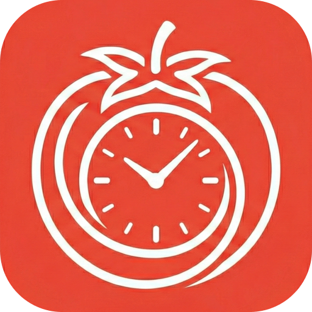

<div align="center">

# Rhei

<p align="center">
  
</p>

**Rhei** is a cross-platform Focus Timer application built with Flutter, designed to help you get into the *flow*. It features a modern, high-performance user experience with a stunning Glassmorphism UI design. Rhei (from *Panta Rhei*) embodies the concept of constant flow and change.

</div>

## ✨ Key Features

- **🎨 Modern Glassmorphism Design**: A sleek, frosted-glass aesthetic offering a premium user experience.
- **🖼️ Multi-Image Background Carousel**: 
  - Select up to 10 images for automatic slideshow
  - Configurable carousel interval (5-60 seconds, default 6s)
  - Smooth crossfade transitions between images
  - Smart image compression (auto-resize to 1920px, JPEG 85% quality)
  - Portrait/landscape photo optimization
  - Modern bottom-sheet image manager with 3-column grid
  - Or use single solid color/image backgrounds
- **📐 Layout Options**: Switch between the focused "Default" view or the aesthetic "Gallery" mode.
- **🎨 Visual Customization**: Fine-tune UI opacity, select your favorite font, and toggle Light/Dark themes.
- **⏱️ Customizable Timer**: Flexible focus and break durations to suit your workflow.
  - **Standard Pomodoro Loop**: 4 Focus sessions + 4 Breaks (Short/Long) per cycle.
  - **Visual Cycle Indicator**: Minimalist dots indicator to track your daily progress.
- **🔊 Immersive Sound System**:
  - Custom alarm and ambient sounds powered by `audioplayers`
  - Modern bottom-sheet sound picker with 4-column grid layout
  - Auto-preview on selection (5s for ambient sounds, full playback for alarms)
  - Add/delete custom audio files for both alarm and ambient sounds
  - Hide/show built-in sounds to personalize your collection
  - Auto-scrolling text for long filenames
  - Performance-optimized with separate preview player and auto-cleanup
- **🔔 Smart Notifications**: Native system notifications keep you informed without being intrusive (`flutter_local_notifications`).
- **📱 Android Home Screen Widget**: Real-time timer display with smart pause control (Focus mode only) and performance-optimized updates.
- **🪟 Advanced Window Control**: "Always on Top" mode ensures your timer is always visible when you need it (`window_manager`).
- **⚡ Performance Optimized**: Efficient resource management ensuring low memory usage even with 8K backgrounds.
- **💻 Cross-Platform**: Optimized for macOS, Windows, Android, and iOS. Desktop window: 405x720 (9:16 portrait ratio).

## 🛠️ Tech Stack

- **Framework**: [Flutter](https://flutter.dev/) (Dart SDK >=3.10.1)
- **State Management**: [Provider](https://pub.dev/packages/provider)
- **Storage**: [shared_preferences](https://pub.dev/packages/shared_preferences) & [path_provider](https://pub.dev/packages/path_provider)
- **Audio**: [audioplayers](https://pub.dev/packages/audioplayers)
- **Image Processing**: [image](https://pub.dev/packages/image)
- **Widgets**: [home_widget](https://pub.dev/packages/home_widget) (Android home screen widget)
- **Desktop Integration**: [window_manager](https://pub.dev/packages/window_manager)
- **UI Extensions**: [flutter_colorpicker](https://pub.dev/packages/flutter_colorpicker), [file_picker](https://pub.dev/packages/file_picker)

## 🚀 Getting Started

### Prerequisites

- [Flutter SDK](https://docs.flutter.dev/get-started/install) installed and configured.
- Compatible IDE (VS Code, Android Studio, etc.).

### Installation

1.  **Clone the repository:**
    ```bash
    git clone git@github.com:IceHugh/rhei.git
    cd rhei
    ```

2.  **Install dependencies:**
    ```bash
    flutter pub get
    ```

3.  **Run the application:**
    ```bash
    # Run on macOS
    flutter run -d macos

    # Run on Android (ensure emulator is running or device connected)
    flutter run -d android
    ```

## 🧑‍💻 Development

### Generating App Icons
If you update `logo.png`, regenerate the platform-specific icons:
```bash
dart run flutter_launcher_icons
```

### Code Style
This project follows strictly configured lints. Check for issues:
```bash
flutter analyze
```


## ⚠️ Troubleshooting

### macOS: "App is damaged" or "Unverified Developer"
If you see a warning that "Rhei cannot be opened because Apple cannot check it for malicious software":

1.  Open **System Settings** > **Privacy & Security**.
2.  Scroll down to the security section and click **"Open Anyway"** for Rhei.

Alternatively, running this command in Terminal will verify the app:
```bash
xattr -d com.apple.quarantine /path/to/Rhei.app
```

## 📄 License

[MIT License](LICENSE) (Placeholder)

---
*Built with ❤️ using Flutter*
